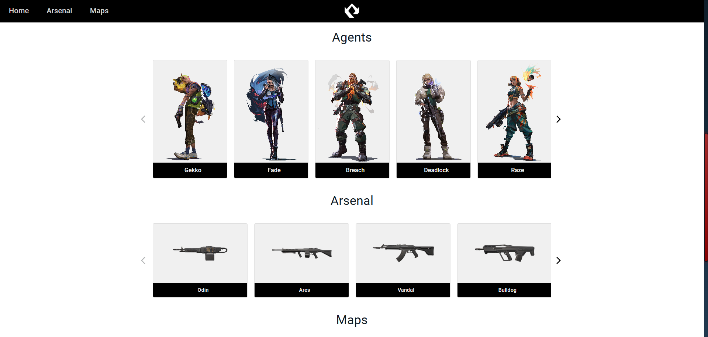
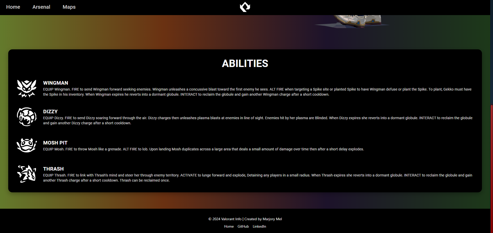
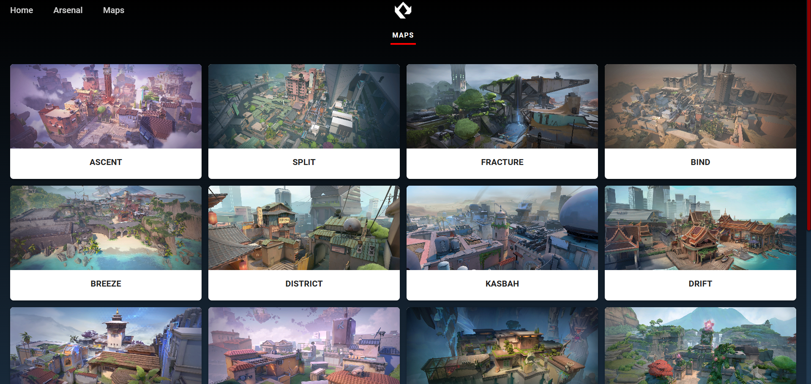
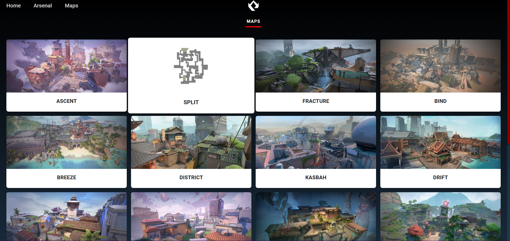
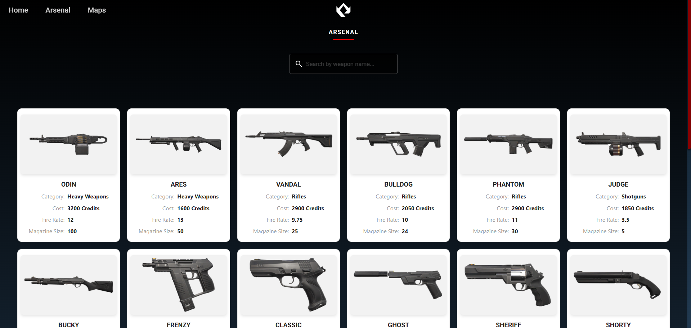
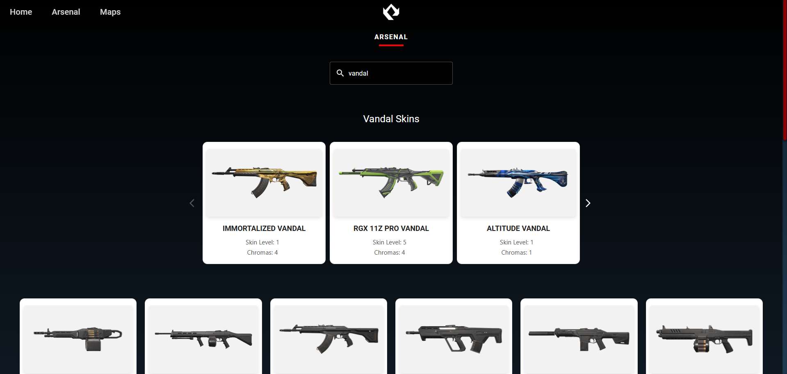

## Valorant Info

Valorant Info is a React-based application that leverages the Valorant API to provide detailed information about the game's agents, weapons, and maps. This project is designed to offer Valorant players quick and easy access to essential game data.

## 🛠 Features

- **Data visualization**: Access comprehensive information about agents, weapons, and maps.
- **Dynamic search**: Perform searches with parameters sent to the JSON API.
- **Field validation**: Validate required fields before submitting data.
- **Error handling**: Display validation error messages before and after API requests.
- **Responsive design**: User-friendly interface optimized for various devices.
- **Advanced componentization**: Implementation of components using Context API.
- **Seamless navigation**: Efficient routing between sections with React Router.

## 🖼 Project Preview

### Home Page

he home page features a banner and carousels for agents, arsenal, and maps. Clicking on any of these items redirects you to their respective pages for more details.




### Agent Page

Displays details such as abilities, roles, portraits, and biographies for each agent.




### Map Page

Presents an interactive gallery of maps with unique features.




### Arsenal Page

Allows searching and viewing detailed weapon information, including stats like fire rate, cost, and magazine size. Additionally, the search feature enables users to look up weapons by name and view available skins for each weapon.




## 📦 Technologies Used

- **React**: For building dynamic user interfaces.
- **React Router**: For navigation between pages.
- **Material-UI**: For modern, responsive component design.
- **Context API**: For managing global state across components.

## 📘 Technical Details

### Hooks Used

- **useCallback**: Applied to event handler functions to avoid unnecessary re-creations, ensuring optimized performance. For example, it was used to manage interaction states on the map and weapon pages.

### Context API

Used for sharing global data such as available weapons, loading states, and error messages across components.

## 🚀 Installation

Follow these steps to set up the project locally:
Clone the repository:

1. Clone this repository to your local machine:

   ```bash
   git clone https://github.com/marjorymell/valorant-info-react-project
   ```

2. Open the terminal and run `npm install` to install all necessary dependencies.
3. Open the terminal and run `npm start` to start the development serve.
4. This will open the app in your browser at http://localhost:3000.

## 🔧 Contributing

Contributions are welcome! Follow these steps to collaborate:

1. Fork the repository.
2. Create a new branch for your feature or fix:

   ```bash
   git checkout -b feature/your-feature-name
   ```

3. Submit your changes and open a pull request.

## :mailbox_with_mail: Contact

If you have any questions, suggestions, or need help with the project, feel free to reach out. Here are some ways to contact me:

- **Name**: Marjory Mel Ferreira Ferro Lemos
- **Email**: [marjorymel48@gmail.com](mailto:marjorymel48l@gmail.com)
- **LinkedIn**: [Marjory Lemos](www.linkedin.com/in/marjorymell)

Thanks! :)
